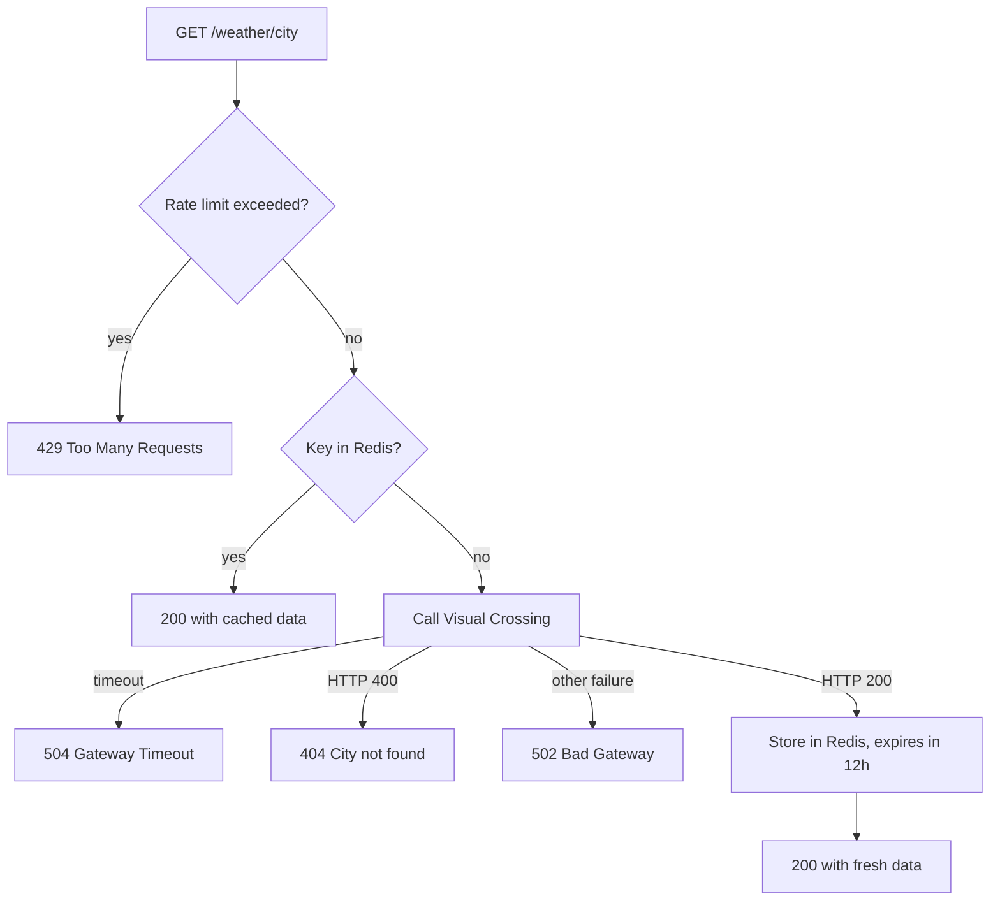

# Weather API Wrapper Service

A small Flask API that returns the current weather for a city. It fetches data from the [Visual Crossing Weather API](https://www.visualcrossing.com/weather-api), caches each result in Redis for 12 hours, and limits how many requests a client can make.

This is a learning project based on the [Weather API](https://roadmap.sh/projects/weather-api-wrapper-service) project from roadmap.sh. It practices:

- consuming a third-party API
- caching responses in Redis with an expiration time
- loading configuration from environment variables
- mapping upstream failures to meaningful HTTP status codes
- rate limiting requests per client IP

## How it works

Each request to `GET /weather/<city>` goes through these steps:

1. **Rate limit.** Flask-Limiter checks the client IP against the limit for the route. Counters are stored in Redis. If the limit is exceeded, the API returns `429`.
2. **Cache lookup.** The city name is normalized (trimmed and lowercased) and used as the Redis key. On a hit, the cached JSON is returned immediately.
3. **Upstream call.** On a miss, the API calls the Visual Crossing Timeline endpoint (metric units, current conditions only) with a 10-second timeout.
4. **Cache write.** The simplified result is stored in Redis with a 12-hour expiration and returned to the client.

Errors raised while calling Visual Crossing are converted into JSON responses (`404`, `502` or `504`), described in [Errors](#errors).



## Tech stack

- Python
- Flask (web framework)
- Flask-Limiter (rate limiting, backed by Redis)
- Redis, via the `redis` Python client (cache and rate limit storage)
- Requests (HTTP client for Visual Crossing)
- python-dotenv (loads the `.env` file)
- Docker (to run Redis locally)

Exact versions are pinned in `requirements.txt`.

## Prerequisites

- Python 3 (developed with Python 3.13)
- Docker, to run Redis
- A free [Visual Crossing](https://www.visualcrossing.com/sign-up) account, to get an API key

## Installation

The commands below are for Windows PowerShell.

1. Clone the repository:

   ```powershell
   git clone https://github.com/rigelsss/weather-api-wrapper-service.git
   cd weather-api-wrapper-service
   ```

2. Create and activate a virtual environment:

   ```powershell
   python -m venv venv
   .\venv\Scripts\Activate.ps1
   ```

   If PowerShell blocks the activation script, run `Set-ExecutionPolicy -Scope CurrentUser RemoteSigned` once and try again.

3. Install the dependencies:

   ```powershell
   pip install -r requirements.txt
   ```

4. Create the `.env` file from the example and fill in your Visual Crossing API key:

   ```powershell
   Copy-Item .env.example .env
   notepad .env
   ```

   ```dotenv
   VISUAL_CROSSING_API_KEY=your_api_key_here
   REDIS_HOST=localhost
   REDIS_PORT=6379
   ```

   The application refuses to start if `VISUAL_CROSSING_API_KEY` is not set.

5. Start Redis in a Docker container:

   ```powershell
   docker run -d --name weather-redis -p 6379:6379 redis
   ```

6. Run the application:

   ```powershell
   python app.py
   ```

   The Flask development server starts at `http://127.0.0.1:5000` with debug mode enabled.

## Usage

### Endpoint

```
GET /weather/<city>
```

`<city>` is any location Visual Crossing can resolve, such as a city name or `city,country`.

### Example request

```powershell
curl.exe http://127.0.0.1:5000/weather/London
```

### Example response

```json
{
  "city": "London, England, United Kingdom",
  "conditions": "Partially cloudy",
  "humidity": 72.4,
  "source": "visualcrossing",
  "temperature": 14.2
}
```

| Field         | Description                                                   |
| ------------- | ------------------------------------------------------------- |
| `city`        | Address as resolved by Visual Crossing (`resolvedAddress`)    |
| `temperature` | Current temperature in degrees Celsius                        |
| `conditions`  | Short text description of the current conditions             |
| `humidity`    | Relative humidity, in percent                                 |
| `source`      | Always `visualcrossing`                                       |

Values above are illustrative. A response served from the cache has exactly the same shape as a fresh one.

## Errors

All handled errors return JSON in the form `{"error": "<message>"}`.

| Status | When it happens | Example message |
| ------ | --------------- | --------------- |
| `404 Not Found` | Visual Crossing answered `400` for the requested location | `City 'Atlantisss' not found` |
| `429 Too Many Requests` | The client exceeded this API's rate limit | `Rate limit exceeded. Please try again later.` |
| `502 Bad Gateway` | Visual Crossing rejected the API key (`401`/`403`) | `Weather provider rejected the API key` |
| `502 Bad Gateway` | Visual Crossing's own rate limit was hit (`429`) | `Weather provider rate limit exceeded` |
| `502 Bad Gateway` | Visual Crossing returned any other non-`200` status | `Weather provider error (500)` |
| `502 Bad Gateway` | The connection to Visual Crossing failed | `Could not connect to the weather provider` |
| `504 Gateway Timeout` | Visual Crossing did not respond within 10 seconds | `Weather provider timed out` |

## Cache and rate limiting

### Cache

- Results are stored in Redis as JSON strings with an expiration of **12 hours** (`CACHE_EXPIRATION_SECONDS` in `config.py`).
- The cache key is the city name exactly as received in the URL, with surrounding whitespace removed and converted to lowercase. For example, `London` and `LONDON` share the key `london`.
- Only successful responses are cached. Errors are never stored.

### Rate limiting

- Requests are counted per client IP address, and the counters are stored in the same Redis instance.
- `GET /weather/<city>` is limited to **5 requests per minute** per IP.
- A default limit of **100 requests per hour** is also configured on the limiter. With Flask-Limiter's default behavior, a route-specific limit replaces the default limits, so in practice the weather route is governed by the 5 per minute limit.

## Project structure

```
weather-api-wrapper-service/
├── app.py              # Flask app: route, rate limiter and error handlers
├── weather_client.py   # Calls Visual Crossing and defines the custom exceptions
├── cache.py            # Reads and writes cached results in Redis
├── config.py           # Loads environment variables and the cache expiration
├── requirements.txt    # Pinned Python dependencies
├── .env.example        # Template for the required environment variables
└── .gitignore          # Excludes .env, venv/ and __pycache__/
```

## Known limitations

- **Cache keys depend on spelling.** Only whitespace and case are normalized, so `Sao Paulo`, `São Paulo` and `Sao Paulo,Brazil` are cached under different keys, even though Visual Crossing resolves them to the same place.
- **Redis is required.** Both the cache and the rate limiter depend on Redis. If Redis is not running, requests fail with a `500 Internal Server Error` instead of falling back to calling Visual Crossing directly.
- **Every upstream `400` is treated as "city not found".** Visual Crossing returns `400` for other invalid requests as well, and all of them are reported as `404`.
- **Rate limit counters are per IP.** Clients behind the same proxy or NAT share the same limit.
- **Development server only.** The app runs on Flask's built-in server with debug mode enabled, which is not intended for production.
